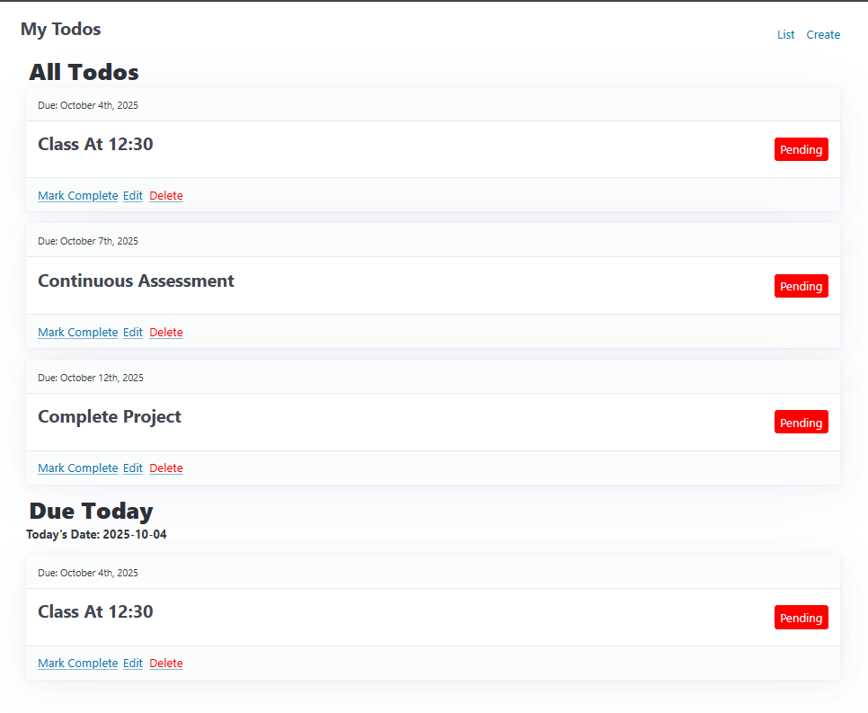
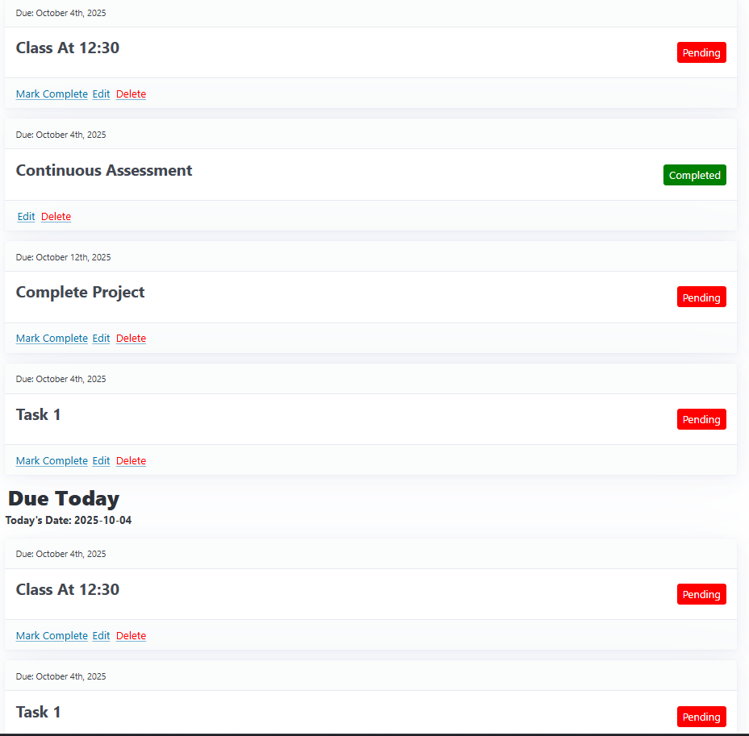
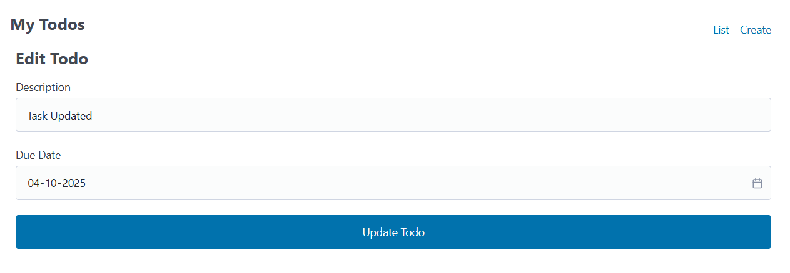
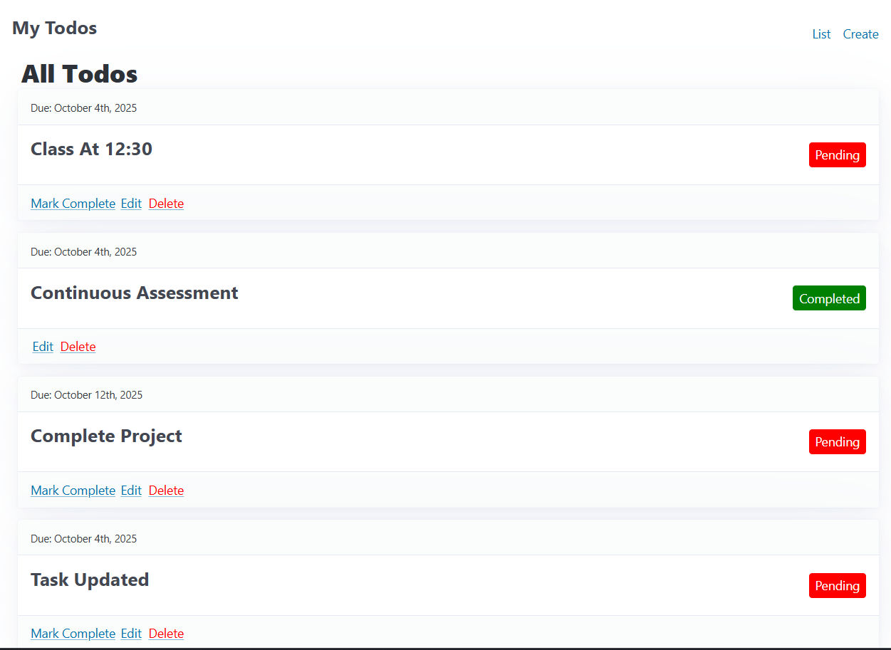

# 📝 Todo App

A simple **Todo application** built with PHP.  
This app allows users to create, manage, and organize their daily tasks efficiently.

---

## 🚀 Features

- ➕ Add new todos  
- ✏️ Edit existing todos  
- ✅ Mark todos as complete/incomplete  
- ❌ Delete todos  
- 📦 Persistent storage (saved across reloads)   

---

## 📸 Screenshots

### 1. Home Page – Task List

---

### 2. Adding a New Todo

---

### 3. Editing a Todo

---

### 4. Completed Todos

---
